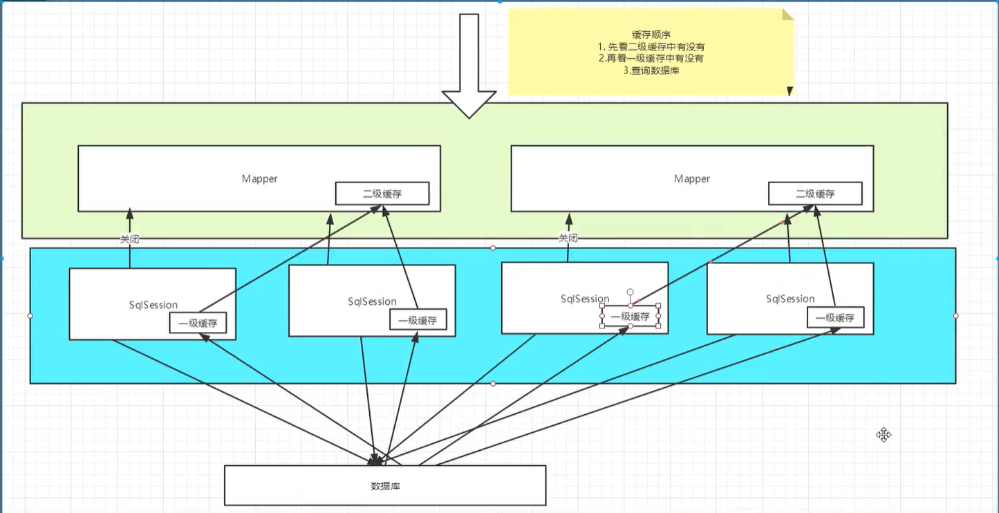
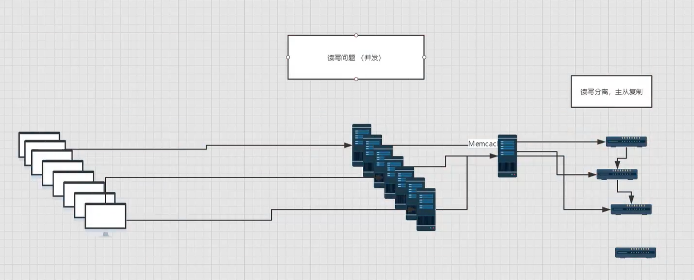
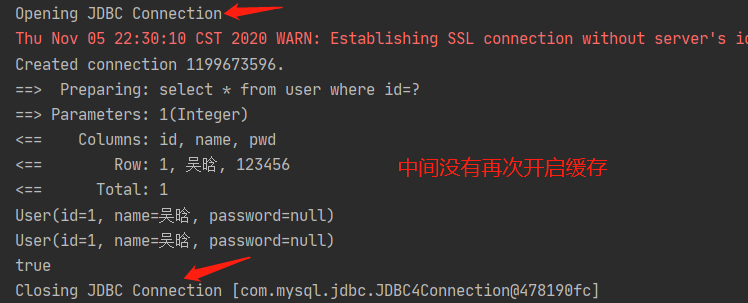
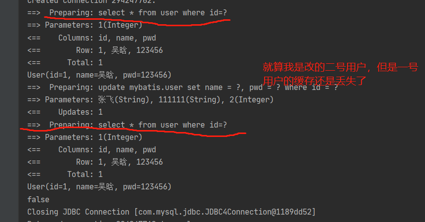
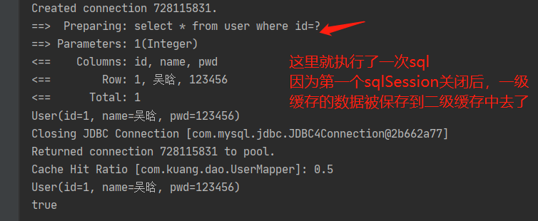
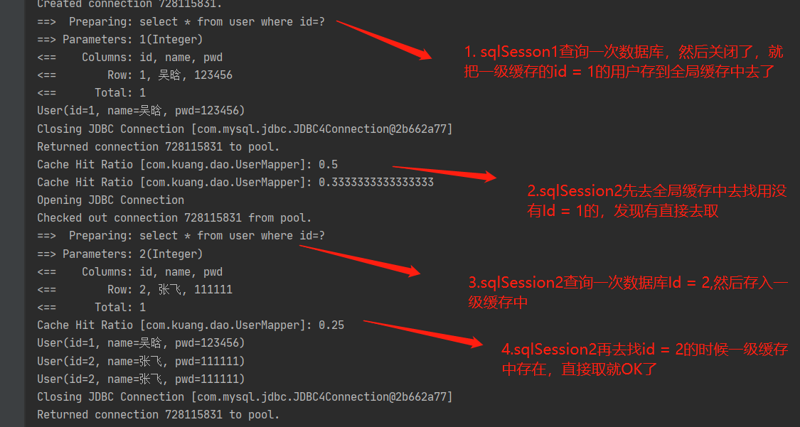

## 缓存

1. 存放在内存中的数据，减少和数据库交互的次数，减少系统开销，提高系统效率。
2. 什么适合使用缓存？ 查。经常查询并且不经常改变的数据
3. 什么不适合使用缓存？改。不经查且经常改的数据

## 验证缓存
打开日志，测试在一个session中查询同一个用户，查看日志输出。缓存生效。
```java
 public void testQueryUserById(){
        SqlSession sqlSession = MybatisUtils.getSqlSession();
        UserMapper mapper = sqlSession.getMapper(UserMapper.class);
        User user = mapper.queryUserById(1);
        System.out.println(user);

        User user2 = mapper.queryUserById(1);
        System.out.println(user2);

        System.out.println(user == user2);
        sqlSession.close();
    }
```


## 缓存失效
#### 一级缓存
0. 一级缓存是默认开启的，只有在一次sqlSession中有效
1. 增删改的操作，有可能会改变数据，所以所有的缓存会失效
2. 缓存会使用最近最少使用算法（LRU, Least Recently Used）算法来清除不需要的缓存。
3. 缓存不会定时进行刷新（也就是说，没有刷新间隔）。


#### 二级缓存
1. 二级缓存也叫全局缓存，由于一级缓存的作用于太窄了所以诞生了全局缓存
2. 全局缓存的作用域是namespace
3. 一个sqlSession关闭后，一级缓存没了。但是 **一级缓存的数据会被缓存到二级缓存中去**。
4. 但是头增删改缓存也会失效


## 缓存总结
```java
 @Test
    public void testQueryUserById(){

        SqlSession sqlSession1 = MybatisUtils.getSqlSession();
        UserMapper mapper = sqlSession1.getMapper(UserMapper.class);
        User user = mapper.queryUserById(1);
        System.out.println(user);
        sqlSession1.close();


        SqlSession sqlSession2 = MybatisUtils.getSqlSession();
        UserMapper mapper2 = sqlSession2.getMapper(UserMapper.class);
        User user2 = mapper2.queryUserById(1);

        User user3 = mapper2.queryUserById(2);
        User user4 = mapper2.queryUserById(2);
        System.out.println(user2);
        System.out.println(user3);
        System.out.println(user4);
        sqlSession2.close();
    }
```
